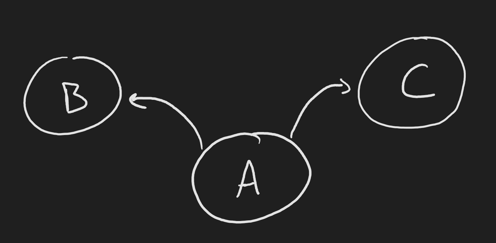

# Consistent Value Function Definitions

In this post, I will define the standard $\gamma$-discounted value functions used in reinforcement learning.
From these definitions, I will discuss two important emergent properties of value functions that prove the self-consistency of the definitions.
I will build up these concepts mathematically, focusing on writing out every step in the derivations and discussing the implications of each step.
These equations are the foundation of many important mathematical proofs in RL and understanding them completely is important to building a theoretical understanding of RL.

## Value functions
Value functions are at the core of reinforcement learning.
For any given state, an agent can query a value function to determine the "value" associated with being in that state.
We traditionally define "value" as being the sum of rewards obtained into the future.
Because of its dependence on what rewards the agent will see in the future, a value function must be defined for a given strategy of behavior; a policy.
That is, the value of a state depends on how the agent behaves after visiting that state; a discussion of "value" that is independent of behavior is meaningless.

We denote a policy as a function which maps a state to a probability distribution over actions.
Formally
$$
\pi : \mathcal{S} \to \Delta(\mathcal{A})
$$
where $\mathcal{S}$ denotes the set of all possible states that the agent can visit (often called the "state space"), $\mathcal{A}$ denotes the set of all possible actions (often called the "action space"), and $\Delta(\mathcal{A})$ denotes the [standard simplex](../simplex.md) over the set of actions.
The standard simplex is simply a formal way of writing a probability distribution over the action space.
Simply put, a policy takes a state and returns a weighting over which actions the agent should take in that state. A large weighting leads to a frequency of selecting that action, a small weighting leads towards a low frequency.

Equipped with an intuitive definition of value functions and a formal definition of policies, we can write a formal definition of value function
$$
v_\pi(s) \doteq \E{\sum_{t=0}^\infty \gamma^t R_{t+1} \; | \; \pi, S_0 = s}.
$$
Note that in [episodic](../TODO.md) problem settings we can assume that $\gamma = 0$ for all transitions after termination, thus these transitions contribute only a sequence of zeros to the sum which can be ignored.

It is important to note that the definition given above is only _one_ possible definition of a value function.
A majority of the theory in reinforcement learning is developed around the $\gamma$-discounted reward value function as defined above, and thus is the definition that we will use.
However other alternatives have been considered, especially recently, including the [average reward](../TODO.md) value function.

The value function defined above asks the question: "given that we are in a certain state, how much reward can we expect to see in the future?"
To use this value function to make decisions, the agent could query the value of possible next states.
For instance, suppose an agent is in state A and there are two actions that lead to states B and C respectively, the agent can ask $v_\pi(B)$: "how much reward would I see in state B?" or $v_\pi(C)$: "how much reward would I see in state C?"

The difficulty with using a state-value function to select actions is that it (a) requires that the agent know the result of an action ahead of time (e.g. that taking the "left" action results in going to state B) and (b) requires that the actions deterministically lead to the same state every time.
The reinforcement learning framework is designed to handle very generic problem settings where both (a) and (b) are not necessarily true.

To overcome these challenges, we introduce the state-action value function (generally just called the "action-value function"; however I dislike this naming convention).
The state-action value function is defined as
$$
q_\pi(s, a) \doteq \E{\sum_{t=0}^\infty \gamma^t R_{t+1} \; | \; \pi, S_0 = s, A_0 = a}.
$$
Notice first that (as the name might imply) this is now a function of a state _and_ an action, and returns an average over future rewards.
The difference between this and the state value function lies only in the first action of the (S, A, R, S, A, R, ...) sequence.
In the case of the state value function, the first action is a random variable distributed according to $\pi(S_0)$; however, in the case of the state-action value function, the first action is non-random and is given.

With access to a state-action value function, an agent need not know the state dynamics of its environment.
It does not need to know that taking the "left" action in state A will lead to state B, which has value $v_\pi(B)$.
Instead, the agent can query its state-action value function for the value of taking the "left" action in state A, $q_\pi(A, \text{left})$.
As we will see in the next section, the fact that the agent no longer needs access to a model of the environment to make decisions is a defining characteristic of the state-action value function.
Intuitively, the state-action value function implicitly learns a model of the environment dynamics.

## Bellman consistency equations

Both $v_\pi$ and $q_\pi$ satisfy a set of so-called Bellman consistency equations.
That is, for any state and action we have
$$
\begin{aligned}
    v_\pi(s) &= \E{q_\pi(s, a) \; | \; S = s, a \sim \pi(s)}
    && (1) \\

    q_\pi(s, a) &= r(s, a) + \gamma \E{v_\pi(s') \; | \; S=s, A=a, s'\sim p(s' | s, a)}
    && (2)
\end{aligned}
$$
where $r(s, a)$ is a function which returns the average one-step reward given state $s$ and action $a$.
That's a bit dense, so let's walk through it piece by piece.

Equation (1) is simply saying, the state value function at state $s$ is equal to the state-action value function at state $s$ if you average over the actions.
Writing the expectation as a sum, we get
$$
v_\pi(s) = \sum_{a \in \mathcal{A}} \pi(a | s) q_\pi(s, a).
$$
This makes sense.
Both value functions have the same definition for future rewards, follow policy $\pi$ and sum up the $\gamma$-discounted rewards as you go.
The value functions only differ on the first step, whether the action is given to us (state-action value functions) or whether we take the average over actions according to $\pi$ (state value functions).

With access to a state-action value function, we can construct arbitrarily many possible state value functions by considering alternative policies for the first action in the sequence.
For instance, imagine the agent would like to consider the scenario where (S, A ~ $\mu$, R, S, A ~ $\pi$, R, S, A ~ $\pi$, R, ...) where the first action is chosen from a policy $\mu$ and all future actions are chosen according to a policy $\pi$.
The value function for this conjunction of policies can be written
$$
v(s) = \sum_{a \in \mathcal{A}} \mu(a | s) q_\pi(s, a).
$$
This exact scenario occurs in the policy-improvement setting, where the agent improves its policy at only one state at a time.
The agent seeks a better policy for the first state, assuming that it follows $\pi$ for all future states then according to the [policy improvement theorem](../TODO.md) we can show that this new joint policy is at least as good as, if not better than, $\pi$.

Equation (2) is trickier.
Let's start with the easy part, the definition of this new function $r(s, a)$,
$$
\begin{aligned}
    r(s, a) &= \sum_{R} p(R | s, a) R
\end{aligned}
$$
which is simply the average reward that I would see on this next transition starting in state $s$ and taking action $a$.

To understand the second part of Equation (2), let's first recall the definition of the value function.
$$
\begin{aligned}
    q_\pi(s_t, a_t)
    &\doteq \E{R_{t+1} + \gamma R_{t+2} + \gamma^2 R_{t+3} + \gamma^3 R_{t+4} + \ldots} \\

    &= \E{R_{t+1} + \gamma \( R_{t+2} + \gamma R_{t+3} + \gamma^2 R_{t+4} + \ldots \)}
    && \anote{Pull out a constant $\gamma$} \\

    & = \E{R_{t+1} + \gamma q_\pi(s_{t+1}, a_{t+1})}
    && \anote{Bellman's Equation} \\

    &= r(s, a) + \gamma \sum_{s' \in \mathcal{S}} p(s' | s, a) \sum_{a' \in \mathcal{A}} \pi(a' | s') q_\pi(s', a')
    && \anote{Write expectations as sums}
\end{aligned}
$$
where the expectation is conditioned on $s_t$ and $a_t$, but I left that detail out for space and clarity.
I also went ahead and substituted the expectation over the first reward for the average reward function we computed above.

Now using what we learned from the first consistency equation (Equation 1), we can write
$$
\begin{aligned}
    q_\pi(s, a)
    &\doteq r(s, a) + \gamma \sum_{s' \in \mathcal{S}} p(s' | s, a) \sum_{a' \in \mathcal{A}} \pi(a' | s') q_\pi(s', a')
    && \anote{From above} \\

    &= r(s, a) + \gamma \sum_{s' \in \mathcal{S}} p(s' | s, a) v_\pi(s').
    && \anote{Using first consistency eqn.} \\

    &= r(s, a) + \gamma \E{v_\pi(s') \; | \; S=s, A=a}
    && \anote{Write sums as expectations}
\end{aligned}
$$
and we recover the second consistency equation, Equation (2).

This second consistency equation gives us some intuition about the difference between a state-action value function and a state value function.
Particularly, the state-action value function differs only in the very first reward of the sequence.
In the state-action case, we consider a reward chosen by the deterministic action $a$, regardless of where that action may have come from (it could be sampled by the policy $\pi$, it could be sampled from some other policy, etc.).
In the state value case, we consider the average reward where the average is taken over all actions according to policy $\pi$.
We can consider no other distribution over actions, nor can we consider specific individual actions (which of course is a particular case of action distributions where all of the probability mass lies on one action).

Having an understanding of the definitions of value functions and policies, as well as some of their core emergent properties, is crucial for the more rigorous constructions in RL proofs.
Having the intuition helps to ease reading proofs and getting "fundamental ideas", but intuition alone is not enough to grasp some of the subtleties in RL; thus often leading to incongruent misconceptions, or bugs in code.
For example, a common misconception is that access to a state-action value function means that one can trivially compute values for _any_ other policy by taking an expectation over actions of that state-action value function.
However, it is clear (hopefully) that this expectation alters only the first step in the trajectory, but all future steps are with respect to the original policy $\pi$.
